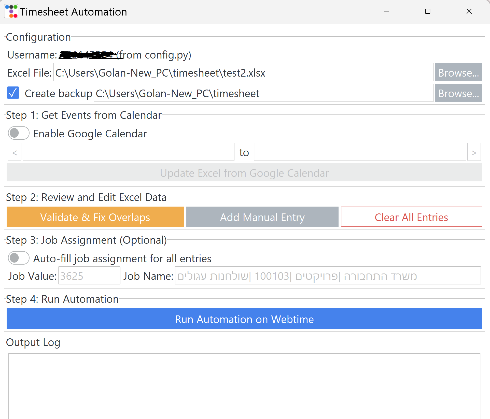

# Timesheet Automation Project

This project provides a comprehensive GUI application to manage and automate the process of filling out an online timesheet. It reads data from an Excel file, allows for powerful data validation and editing, integrates with Google Calendar, and finally uses Selenium to input the data into a web-based timesheet system.

## Features

### Core Automation
*   **Automated Login:** Logs into the timesheet system using credentials stored in `config.py`.
*   **Dynamic Row Addition:** Automatically adds new rows on the timesheet webpage for multiple entries on the same day.
*   **Robust Field Filling:** Uses Selenium with explicit waits for reliable data entry.
*   **Auto-fill Job Assignment:** Automatically fills job assignment fields for all timesheet entries with a configurable job value and name, saving time on repetitive selections.

### Data Management & Integrity
*   **File Selection from GUI:** Instead of being limited to a hardcoded path, you can browse and select any Excel file directly from the application.
*   **Configurable Automatic Backups:** A timestamped backup of your Excel file is created in a user-specified folder before any modification. This feature can be toggled on or off.
*   **Excel Overlap Validation:** A dedicated "Validate & Fix Overlaps" tool scans your Excel file for any entries on the same day with overlapping times.
    *   **Interactive Resolution Dialog:** If overlaps are found, a user-friendly dialog appears, showing the conflicting entries for each day. Overlapping rows are highlighted in red.
    *   **In-GUI Editing:** You can double-click any cell (Start Time, End Time, Notes) directly in the dialog to make corrections without opening Excel.
    *   **Automatic "Hours" Recalculation:** When you edit start or end times, the "Hours" column is automatically and correctly recalculated before saving.
*   **Manual Entry Form:** A convenient "Add Manual Entry" button opens a form to quickly add new timesheet entries directly to your Excel file. The file is automatically sorted after the addition.
*   **Clear Sheet Utility:** A "Clear All Entries" button allows you to safely reset your timesheet for a new period after a confirmation prompt.

### Google Calendar Integration
*   **Event Import:** Imports events from your Google Calendar, including start time, end time, and title, and appends them to the Excel file.
*   **Intelligent Conflict Resolution:** When importing Google Calendar events, the system intelligently handles time overlaps with existing Excel entries. A graphical dialog will appear, allowing you to choose which events to keep (new, existing, both, or neither), ensuring no data is overwritten without your explicit consent.
    *   **Detailed Conflict Resolution Logic:**
        1.  **Load Existing Data:** All current entries from your Excel file are loaded into memory.
        2.  **Process New Events Sequentially:** Each new event fetched from Google Calendar is processed one by one.
        3.  **Duplicate Check:** Before checking for conflicts, the system verifies if the new Google event is an exact duplicate of an entry already in memory. Duplicates are skipped.
        4.  **Overlap Detection:** If the new Google event is not a duplicate, its time slot is compared against *all* other events currently in memory.
        5.  **Interactive Resolution:** If an overlap is detected, a graphical dialog (`ConflictResolutionDialog`) will appear, presenting both the new Google event and the conflicting event, allowing you to choose how to resolve it.
        6.  **Dynamic Update:** Your decision in the pop-up directly updates the in-memory list of events, ensuring subsequent conflict checks reflect the most current state of your timesheet data.

### User Interface
*   **Guided Workflow:** The application is structured into "Step 1," "Step 2," "Step 3," and "Step 4" to guide you through a logical workflow, preventing common errors like overwriting manual fixes.
*   **Live Total Hours Display:** A status bar at the bottom of the application shows the total hours calculated from your Excel file, updating in real-time after any changes.
*   **Modern Themed Interface:** Built with `ttkbootstrap` for a clean, professional, and easy-to-use experience.

### Job Assignment Automation (New Feature)
*   **Configurable Auto-fill:** Enable the "Auto-fill job assignment for all entries" checkbox to automatically populate job assignment fields for every timesheet entry.
*   **Customizable Values:**
    *   **Job Value:** The internal job ID (e.g., "3625") that corresponds to the job option in the timesheet system.
    *   **Job Name:** The display name for the job assignment (e.g., "משרד התחבורה |פרויקטים |100103 |שולחנות עגולים").
*   **Intelligent Filling:** The system attempts multiple methods to fill the job assignment:
    1.  Clicks the assignment field to open the options dropdown
    2.  Selects the option with the matching job value
    3.  Falls back to JavaScript injection if the dropdown method fails
*   **Error Handling:** If job assignment fails for a specific row, the automation logs a warning but continues processing other entries, ensuring the entire process doesn't fail.

## How to Use

### 1. Prepare your Excel File

*   Ensure your Excel file (`.xlsx`) has the following columns (Hebrew names as used in the script):
    *   `שנה` (Year)
    *   `חודש` (Month)
    *   `יום` (Day)
    *   `זמן התחלה` (Start Time - e.g., "09:00")
    *   `זמן סיום` (End Time - e.g., "17:00")
    *   `שעות` (Hours)
    *   `מה` (Notes/Description of work)
*   Example data:
    | שנה | חודש | יום | זמן התחלה | זמן סיום | שעות | מה |
    |-----|------|-----|------------|----------|------|----|
    | 2024| 6    | 25  | 09:00      | 13:00    | 4.0  | Project A |
    | 2024| 6    | 25  | 14:00      | 17:00    | 3.0  | Project B |

### 2. Install Dependencies

Make sure you have Python installed. Then, install the required libraries:

```bash
pip install pandas selenium webdriver-manager openpyxl google-api-python-client google-auth-httplib2 google-auth-oauthlib ttkbootstrap
```

### 3. Set Up Google Calendar API Credentials

To use the Google Calendar integration, you need to obtain a `credentials.json` file from the Google Cloud Platform.

1.  **Go to the [Google Cloud Console](https://console.cloud.google.com/)**.
2.  **Create a new project**.
3.  **Enable the Google Calendar API**.
4.  **Create an OAuth 2.0 Client ID for a Desktop application**.
5.  **Download the `credentials.json` file** and place it in the same directory as the script.

For detailed, step-by-step instructions, please refer to the official Google documentation on [creating an OAuth 2.0 client ID](https://developers.google.com/workspace/guides/create-credentials).

### 4. Run the Application

Execute the `timesheet_gui.py` script to open the graphical user interface:

```bash
python timesheet_gui.py
```

<div align="center">

## The App



This is the Timesheet Automation application.<br>
It provides a complete suite of tools to manage and automate your timesheet, including the new Job Assignment auto-fill feature.

</div>

From the GUI, follow the guided steps:
1.  **Step 1: Get Events from Calendar:** Select your Excel file and import events from Google Calendar.
2.  **Step 2: Review and Edit Excel Data:** Use the powerful tools to validate overlaps, add manual entries, or clear the sheet.
3.  **Step 3: Job Assignment (Optional):** Enable auto-fill job assignment and configure the job value and name to be automatically filled for all timesheet entries.
4.  **Step 4: Run Automation:** Fill the online timesheet based on the clean data in your Excel file.

## Important Note

*  The script will fill in all the timesheet entries based on your Excel file. **It will NOT automatically click the "Submit" or "Save" button on the webpage.** After the script finishes, you will need to manually review the entries on the webpage and click the appropriate button to finalize your timesheet submission.

## Recent Updates

### Job Assignment Auto-fill Feature
*   Added a new "Step 3: Job Assignment (Optional)" section in the GUI
*   Users can now enable automatic job assignment filling for all timesheet entries
*   Configurable job value and job name fields with sensible defaults
*   Robust implementation with multiple fallback methods for maximum compatibility
*   Command-line support for `--job-value` and `--job-name` parameters in `timesheet_filler.py`
*   Enhanced error handling to prevent job assignment issues from breaking the entire automation

### Enhanced .gitignore
*   Updated to only track essential project files
*   Automatically ignores build artifacts, backups, and sensitive configuration files
